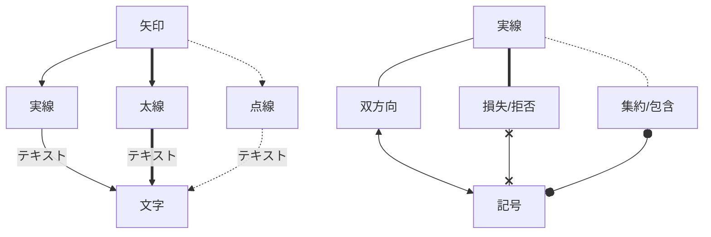
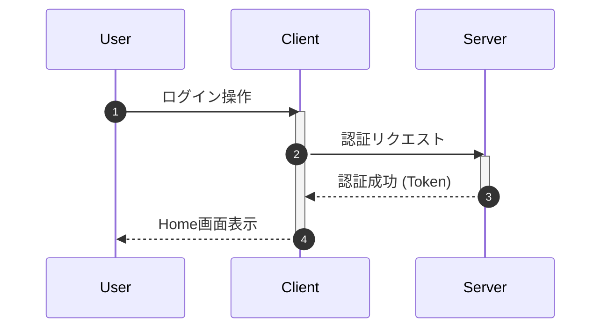

# 使い方
- ログインが必須（画面右上のログインから）
- 作業名・プロジェクト名・作業区分を入力して開始を押すと集計開始
  - すべて空でも入力できるので、とりあえずボタンだけおして後から編集することも可能
  - 終了を押さずに開始を押せば前の作業は自動で終了する
- 「空きを埋める」を押すと、連続していない時間を「事務作業」で埋める

```mermaid
flowchart TD
  %% 基本の線とテキスト追加 (パイプ記法)
  A[矢印] --> B[実線] -->|テキスト| E[文字]
  A ==> C[太線] ==>|テキスト| E
  A -.-> D[点線] -.->|テキスト| E

  %% 特殊な線と記号
  F[実線] --- G[双方向] <--> J[記号]
  F === H[損失/拒否] x--x J
  F -.- I[集約/包含] o--o J
```

```mermaid
sequenceDiagram
  autonumber
  participant U as User
  participant C as Client
  participant S as Server

  U ->> C: ログイン操作
  activate C
  C ->> S: 認証リクエスト
  activate S
  S -->> C: 認証成功 (Token)
  deactivate S
  C -->> U: Home画面表示
  deactivate C
```